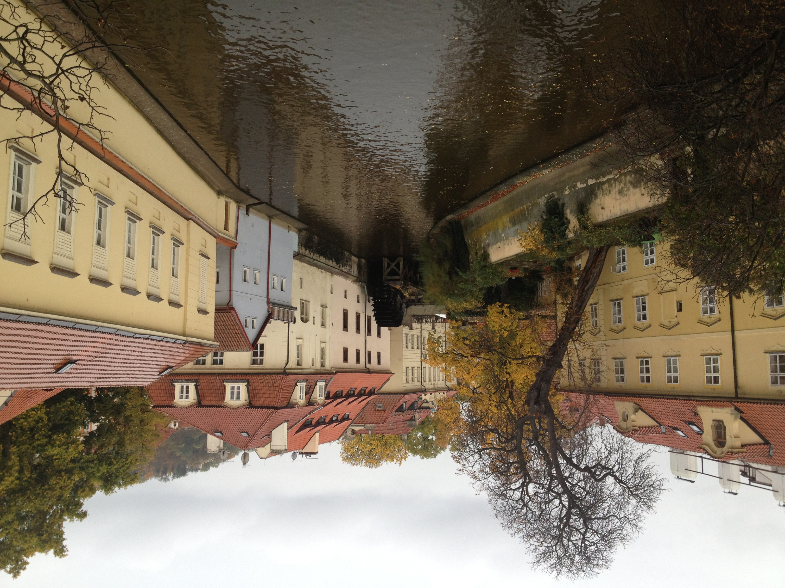
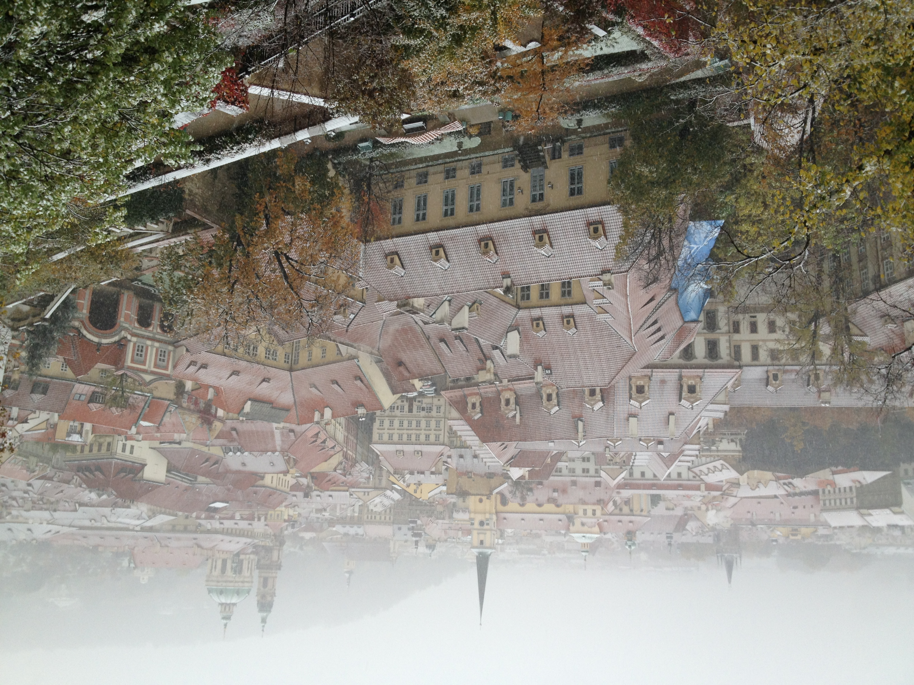
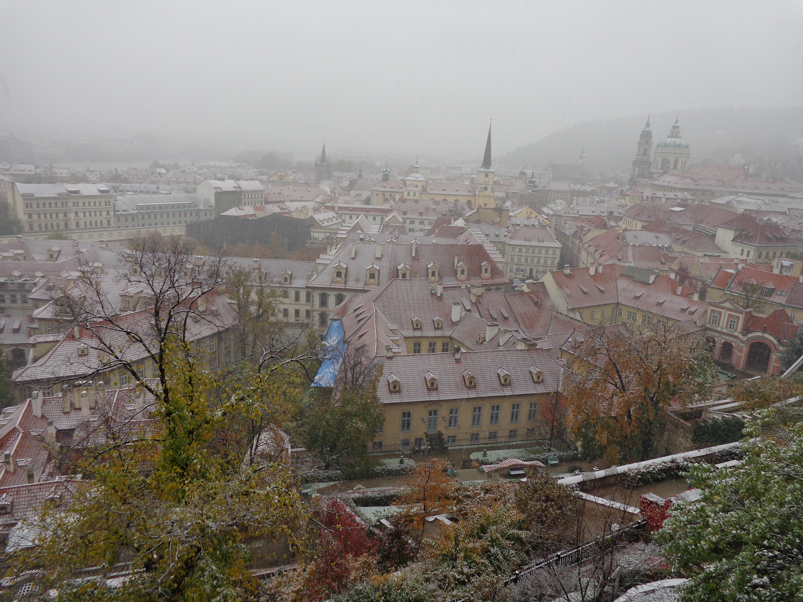

  

  

  

  
I was a little ninja here. slyly stealing your warmth, like the air was stealing mine. Disappearing, reappearing,  pretending I wasn’t lost, and debating programming like politics to feel like a badass.

  

  

  

We showed up without plans and walked until my fingers froze. Walked on forts, past gates, and into bars full of cheap beer and hot wine.
Walked until we reached my favorite spot in
this movie set: at the far end of Charles bridge, to the left, where a little creek runs through a watermill next to an orange house in front of a cobblestone trail. My pristine picture of Prague.

  

  

  

  
We climbed castles on a hill, up winding staircases lit by the kind of lanterns you only see on the covers of children’s books these days. The setting sun sped our steps through crayon landscapes, a yellow brick road

  

  

  

  
And that’s when I realized why Prague felt like home.

  

  

  

  
It was there, in the absence of comfort, we shared a space that only friends know. Through cold rain that led the way home, we laughed and repeated how lucky we were to be here, how beautiful this city is, and how excited we were about our lives.

  

  

  

  
Yeah, we’re really lucky.

