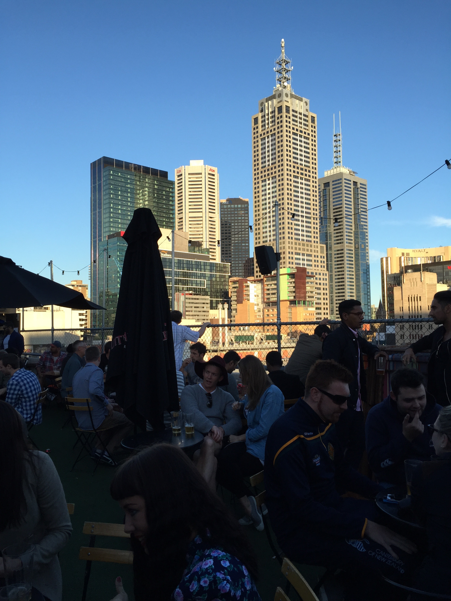
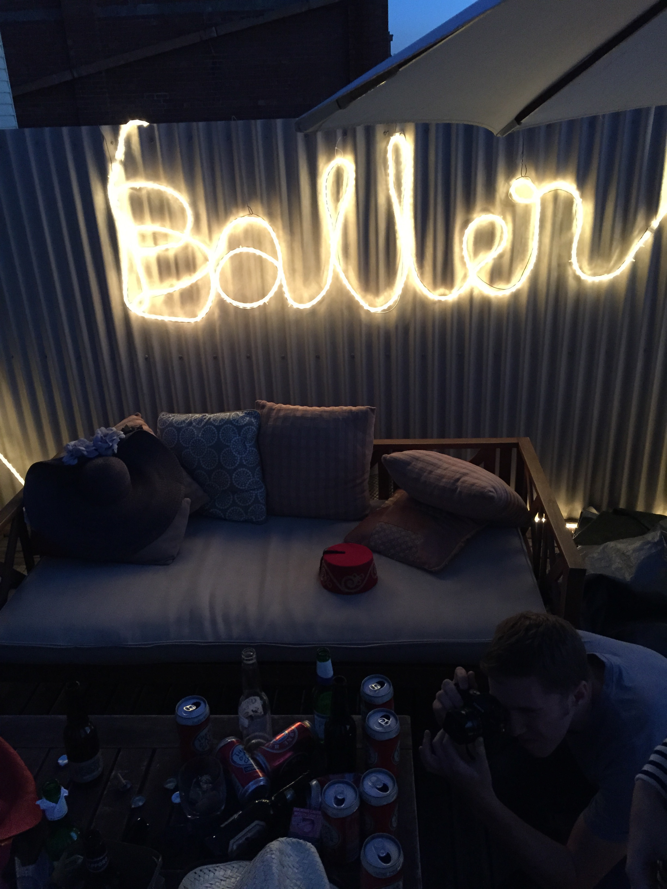

  
  

  
  

Melbourne. I can only look back at it with a smile on my face. The first thing that comes to mind is a big light-up sign: Baller. Then: strange green cafes closing, Magnums fueling midnight chatter, sitting in bean bags, nerding out.
 
There were lights and rooftops. A lot of rooftops. Seven sets of stairs to the cinema where we spilled cider and laughed. Planning our emergency exit: those small unremarkably memorable conversations.
 
Cheerful accents were the chorus and I was giggling along behind a borrowed orange sun hat. I love Australia, but I love Australians more.
 
<blockquote>"Can I tether your connection? I need to find a place to stay tomorrow"</blockquote>
 
I don't think I wore enough black.

