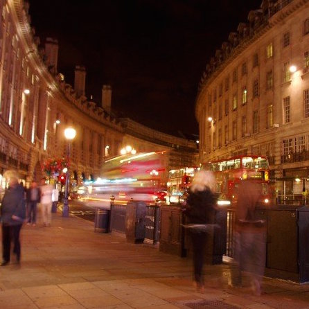
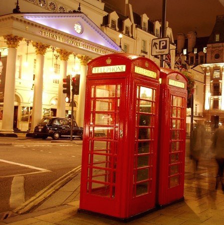
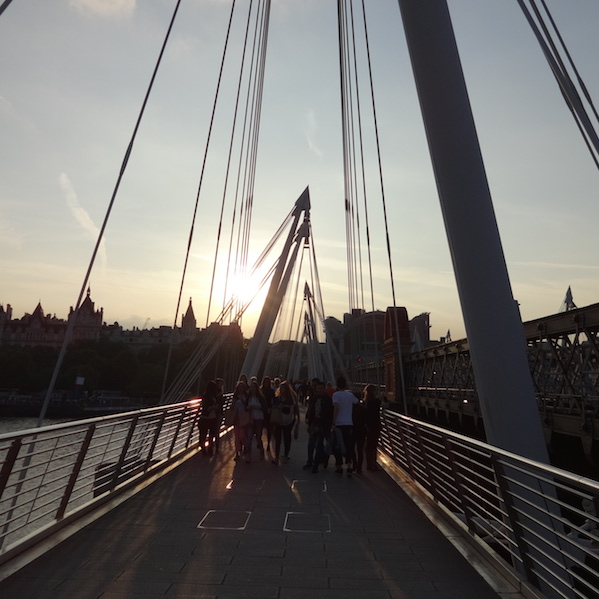
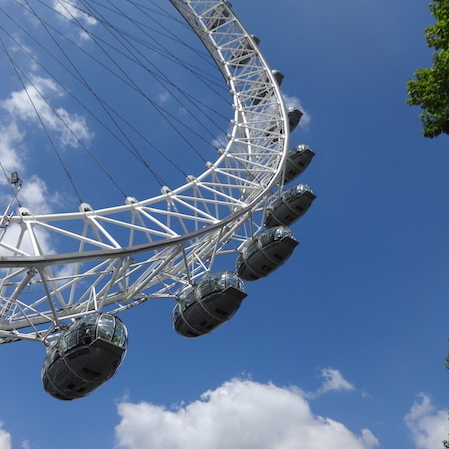
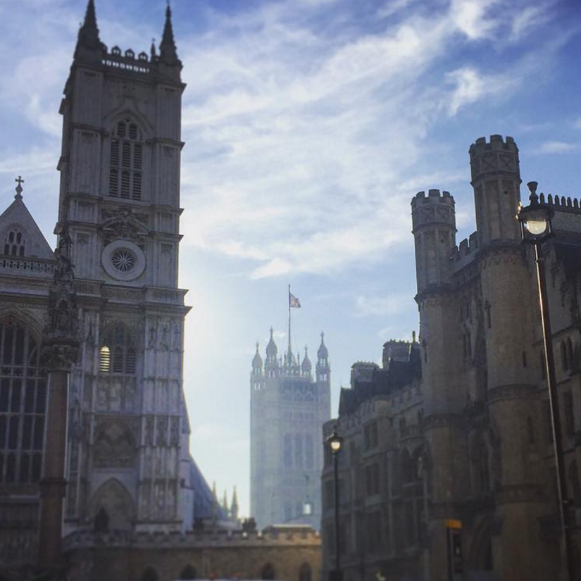
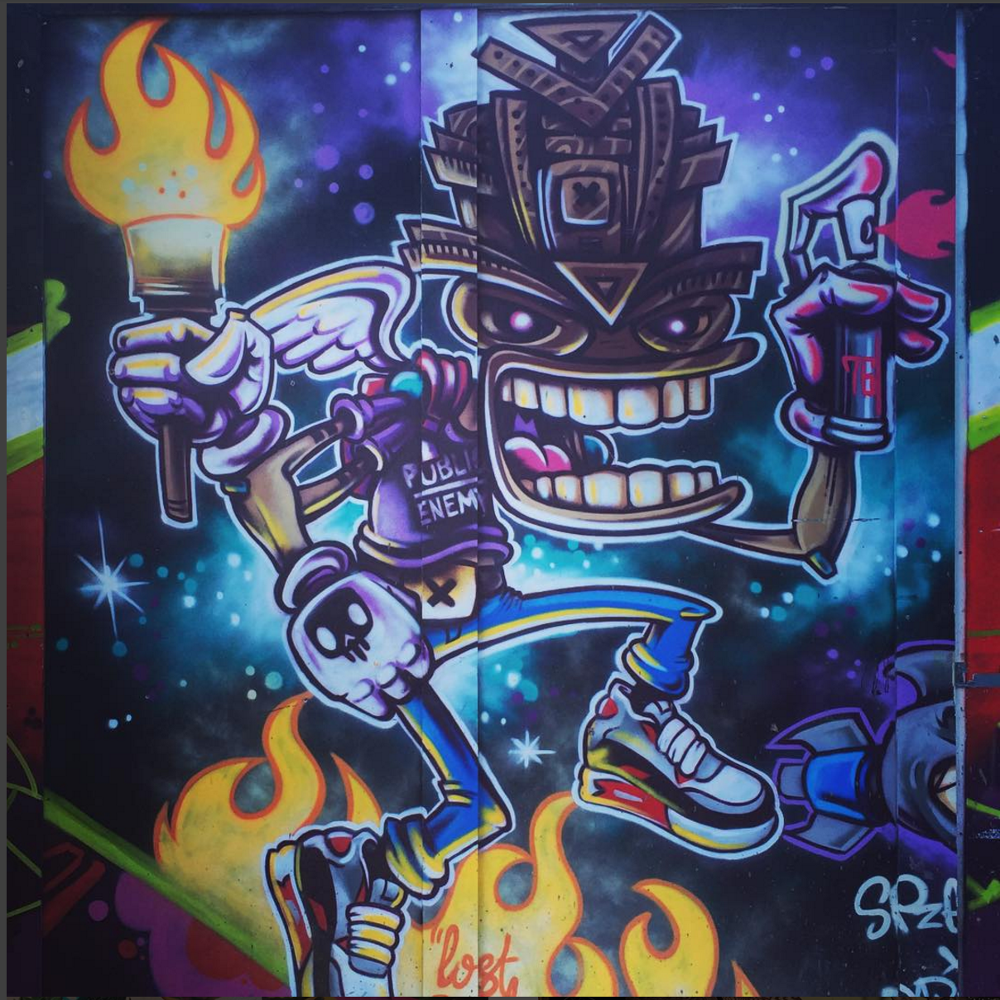

<ul class="photograph-composition">
  <li>
    <figure class="visual">
      
    </figure>
    <figcaption class="date">April 2012</figcaption>
  </li>
  <li>
    <figure class="visual">
      
    </figure>
    <figcaption class="date">April 2012</figcaption>
  </li>
  <li>
    <figure class="visual">
      
    </figure>
    <figcaption class="date">May 2014</figcaption>
  </li>
  <li>
    <figure class="visual">
      
    </figure>
    <figcaption class="date">May 2014</figcaption>
  </li>
  <li>
    

    Only three days later and I find myself back on the Piccadilly line to Heathrow. The stamp still on my arm — 2 by 4 faded black ink from a certain discount suit company. I can’t read the address, or the telephone — just the name. And I guess that's all that I’m ever meant to remember: a dim basement bar, backlit and full of spirit. A warm hum in the air matched the warm light on the back of my glass, my fingers became shadows as they warmed up from the biting outside air.
    

  </li>
  <li>
    

      Sipping cocktails while belting out 50’s music and delightfully dancing the Charleston; clapping when we could to the DJ who stored his CDs in the ceiling and sang with us, smiling.
        
      Britain has the best people.
    

  </li>
  <li>
    <figure class="visual">
      
    </figure>
    <figcaption class="date">Sept 2015</figcaption>
  </li>
  <li>
    <figure class="visual">
      
    </figure>
    <figcaption class="date">Nov 2015</figcaption>
  </li>
  <li>
    

      I conclude that every east side is the trendy side. We spent a lot of time in our hipster hotel cocktail bar served by men with man buns as we talked about scotch, the places we came from, and the places we still want to see. Reunions with friends I continue to encounter in new countries each time. I barely had to say goodbye at all.
        
      November 2015.
    

  </li>
</ul>
